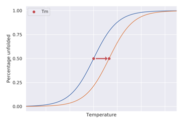
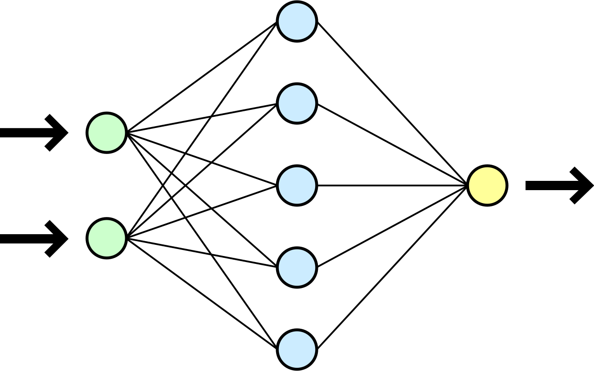
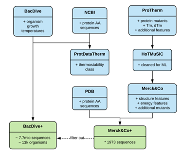
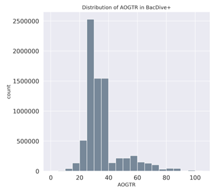
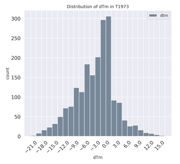

<html><head><meta content="text/html; charset=UTF-8" http-equiv="content-type"></head><body class="c11">

In-silico Project Design

As with all great scientific projects, in the beginning, there is only a vision; a vision of how the results of the project will impact the lives of many people for the better: the core reason for our efforts.

Our vision was simple, yet daring:

Support scientists in the wet lab in the creation of more thermophilic proteins by suggesting thermostability improving mutations, which should reduce the necessity for expensive experimentation.

In the beginning, none of us had any idea how to approach this problem as we come from an interdisciplinary background of biology and computer science. However, through careful planning, and diligent research, we managed to tackle this notoriously hard problem and overcome many challenges. In the end, the results speak for themselves, which is why we feel confirmed in our project design and overall approach.&nbsp;

Problem setting

Overall, we wanted to develop an application (preferably web-based) that any researcher with internet access could use. This application should be able to give a mutated version of a protein (or a list of suggested mutations) for a polypeptide specified by the user. The specified mutant should have a higher melting temperature as the protein specified by the user, if possible. All the internal workings should be hidden away, but accessible through the code provided on GitHub. This provides an easy to use interface with a straight forward use case.

 Subtitle: Visualisation of change in melting temperature (dTM) between wild type (blue) and mutant (orange) proteins

The first step to towards this goal was to figure out how to predict single point mutations which improve thermostability.

Neural Networks

Since the main machine learning architecture used during our research are Artificial Neural Networks, here is a brief intro:

The archetypical neural network looks something like this:

(https://de.wikipedia.org/wiki/K%C3%BCnstliches_neuronales_Netz#/media/Datei:Neural_network.svg)

It has an input layer (the green one on the left), where we feed the network with data. Then it can have multiple hidden layers (the blue one) where most of the computation is going on, and finally an output layer (yellow one) were we get the results/predictions of our networks.

Each dot in this graph constitutes a single artificial neuron (inspired by the neurons in our brain), which has its inputs (here from the left) does some computation (just some basic multiplication and addition based on the inputs and its current state, followed by an activation) and outputs a number (the result of the internal computation), which is passed along to the next layer.

These networks can be &ldquo;trained&rdquo; to give some specific output based on the input which works something like this: we feed the network a data sample, the networks gives a prediction for that data point, and we tell it how good the prediction was. Based on this feedback the network adjusts the internal states of the artificial neurons, so that next time the prediction is closer to what we would judge as correct.

Design Iterations

In our project we went through five main iterations to continuously improve the results of our goal. First we researched the current status in literature in relation to our project. Afterwards we had to steps on different dataset to improve our modeling to predict protein temperature stability. Building on the best models we developed an approach to generate more heat resistance sequences. Lastly we worked on further ideas which can be used to improve the results.

1. Literature research

Since we did not know anything about the literature in this problem domain, we had to familiarize ourselves with it from the ground up. During this process we identified the following problems:

1. &nbsp;&nbsp;&nbsp;&nbsp;&nbsp;&nbsp;&nbsp;&nbsp;&nbsp;Lack of available data

2. &nbsp;&nbsp;&nbsp;&nbsp;&nbsp;&nbsp;&nbsp;&nbsp;&nbsp;Low quality of most available data

3. &nbsp;&nbsp;&nbsp;&nbsp;&nbsp;&nbsp;&nbsp;&nbsp;&nbsp;Insufficient validation of previous results

4. &nbsp;&nbsp;&nbsp;&nbsp;&nbsp;&nbsp;&nbsp;&nbsp;&nbsp;Difficult generalization of models to other datasets

5. &nbsp;&nbsp;&nbsp;&nbsp;&nbsp;&nbsp;&nbsp;&nbsp;&nbsp;Reliance on expensive 3D structure computations

Problems 3 and 4 were managed by relying on very recent high quality research which we also used as a baseline to compare our results against. [1]

From previous modeling approaches and results, we distilled that a machine learning based approaches, specifically relying on transfer learning, are likely to have the most effects on this topic.

Transfer learning is known to improve the generalizations of models, in this case the performance of the model on previously unseen proteins and their mutants which is from our viewpoint one of the most important aspects. For this a large dataset of proteins is needed.

Concerning the computation of 3D structure we decided to only rely on the primary amino acid structure of the protein, which is available in a lot larger dataset then the 3D structure.

Datasets

NCBI dataset: Our first approach was to search the National Center for Biotechnology Information (abbreviation NCBI) database for thermophilic organisms and extract their proteins which resulted in around ~100k proteins for which we knew where thermophilic which we used a validation for some models.

This data was not sufficient for our use case this is why we researched and aggregated data of other existing datasets.

Subtitle: Overview of datasets related to protein thermostability

ProTherm&nbsp;[2]:

1. Widely used in this problem domain 2. Contains: Wildtype mutant pairs with dTm information (size ~18k) 3. Problem: tried preprocessing, but failed due to complexity of task

ProtDataTherm&nbsp;[3]:

1. Large dataset suitable for deep neural networks 2. Contains: Proteins and their source organism&rsquo;s growth temperature class (size ~9Mio) 3. Problem: only contains thermostability class, and not temperature

BacDive&nbsp;[4]:

This database contains various information on bacteria, including their growth temperature range. We used this database in combination with the NCBI database to construct the BacDive+ dataset, which contains paris of protein amino acid sequences and organism growth temperature information (of the organism the proteins sequence can be found in). The construction of BacDive+ is thus very similar to ProtDataTherm, however, we kept the real valued information about the organism growth temperature and did not convert it into thermal stability classes. The overall size of the dataset is about 7Mio sequences and 20k organisms. In the graph below you can see the distribution of the Averaged Organism Growth Temperature range among the proteins:

Merck&amp;Co&nbsp;[1]:

The Merck&amp;Co dataset stems from the McGuinness et al. 2019 paper and is the bases for the Merck&amp;Co+ dataset, which we constructed by additionally supplementing the dataset with the actual amino acid sequences and sequence representations extracted from one of our deep convolutional neural networks. Overall it is a high quality dataset based on ProTherm-&gt;HoTMuSiC-&gt;Merck&amp;Co-&gt;Merck&amp;Co+ and contains about 2k wildtype and mutant AA sequence pairs (and their corresponding mutation) with many features and the change in melting temperature (dTm), which we tried to predict. Below you can see the distribution of the label (the dTm) in the overall dataset.

From our literature research we knew that Support Vector Machines and Random Forests performed well on predicting dTm upon single point mutations. However, we wanted to advance this research with the following more advanced and new machine learning methods.

Gradient Boosting:

This approach works similar to random forests which were used in previous research. Advancing the random forest this approach differs through weak learners which are correlated and the model exploits knowledge about previously made mistakes. 

Cycle GANs&nbsp;[5](Generative Adversarial Networks):

Can transform one image of domain A into another of domain B and back. Specifically this was used for images in which a horse is used to look like a zebra. We wanted to use this to transform mesophilic proteins into thermophilic ones. The Problem is changes made by the model are probably too drastic which then would also affect functionality and is a lot harder to validate.

Deep Neural Networks:

Neural networks have been tried by other researchers, but only very rudimentarily as they require a lot of data and for Deep Neural Networks with a lot more layser larger amounts of research. Two common types of neural networks are relevant for our use case Convolutional Neural Networks as they perform well too learn more advanced feature about sequential data and residual layers which use jump connections to improve the learning process and avoid getting stuck on local minimas.

Simulated Evolution:

Once we have a working architecture to predict thermostability increasing mutations, we can use simulated evolution to further increase the thermostability of the protein. The evolution process is very useful as there is a huge space of possible mutation combinations and it can be hard to find optimal combinations without it.

2 Organism thermostability prediction

2.1 Organism thermostability class prediction

As a first approach we looked for available large scale datasets with relation to protein thermostability that we could use for training deep neural networks. 

We found ProtDataTerm suitable, so we used it as the training dataset for a deep convolutional neural network according to best practices. We also continued tuning the network in an explorative way in a triple cross-validation fashion.

The input to the network was the label encoded sequence, the output either 1 for thermostable, or 0 for mesostable. We evaluated the performance using the AUC value of the ROC curve, since ProtDataTherm is an unbalanced dataset (mesostable proteins overrepresented).

After the evaluation, however, we started thinking about using the network for transfer learning for protein melting temperature prediction, and decided that since thermostability class prediction is fundamentally a classification problem, we should look for a dataset with which we could perform a regression, which would be more close to the regression problem of predicting protein melting temperature, thus we created BacDive+.

2.2 Organism growth temperature prediction

Our next step is to more accurately determine the temperature stability a proteins for this we use the averaged &nbsp;organism growth temperature range (AOGTR) of about 7Mio proteins found in the BacDive+ dataset.

To increase the generalization capability of our models, we trained our deep residual Convolutional Neural Networks on a larger set of data to prevent the models from overfitting on the relatively small datasets that contain information about mutations and the corresponding melting temperature change. The expectation is that the model learns key patterns that make a sequence thermophilic which is already researched to be the case for image classification using similar networks.

The connections to predicting thermostability in the form of the melting temperature is the following: Proteins of an organism with high growth temperature must also function at higher temperatures, so most of the proteins probably have a higher melting temperature as well.

The implications here are more of a statistical nature and not without its exceptions e.g. there are a hand full of proteins in E.coli which survive cooking, but it&rsquo;s exactly this statistical correlation which the deep residual Convolutional Neural Networks and later exploit to create more thermostable mutants.

The Neural Networks were fed with the encoded amino acid sequence where one to twenty represent the canonical amino acids and zero the end of the sequence. We used proteins with length of 50 to 650 to avoid untypical proteins and expected as the output the AOGTR.

The network was trained with a classical triple cross-validation method using 80%/20% train/test split and was optimized using manual hyper tuning of the parameters. Additionally we used ensemble networks to improve the performance. Ensembles work by averaging over the results of multiple different networks as each network learned slightly different things about the data.

3 Protein melting temperature prediction

Merck&amp;Co+ Validation &amp; Baselines

For our baseline, we compared ourselves with the Mc Guinness et al.&nbsp;paper.

We used the Merck&amp;Co+&nbsp;dataset&nbsp;with representations extracted from the pre learned deep Convolutional Neural Networks (feed the network with a sequence and extract the output at a chosen layer). For the architecture, we chose the state of the art gradient (tree) boosting library called XGBoost&nbsp;which is regularly used in machine learning competitions.

We trained our models in a 7-trial 5-fold cross-validation,&nbsp;or alternatively, in a novel Leave-one-protein-out cross-validation (one protein and its mutants in the holdout set on each split) fashion, with Bayesian Optimization&nbsp;as hyper parameter tuning.

This allowed for a detailed comparison with current research and gave us important feedback on moving forward.

4 Generation of heat resistant mutants

Finally, we created an application that given an input AA sequence outputs mutants that it predicted to be more thermostable as well as very similar proteins found with tBlastn &nbsp;which are more heat resistant. For the latter we run our models on the most similar sequences of the blast results and return the ones with most similarity and heat resistance.

The mutation are done differently. We decided to use the tBlastn result to find mutations which naturally occur in proteins and only use these to be allowed for mutations which means their exact position and amino acid. To further avoid functional changes we don&rsquo;t allow mutations in active centers which have to be previously set.

Our experiments showed that we need to introduce multiple mutations to increase the melting temperature of our protein by a significant amount through a cumulative effect. We decided to use a simulated evolution approach as the search field for possible mutations is very large. The evolutionary approach works similar to evolution in nature including cross over of good mutations and a higher &ldquo;survival&rdquo; chance of mutations to be kept based on how much they improve thermostability.

We planned to use the model for the prediction of protein functions (for more information have a look at the Project/Improve section) to also affect the survival rate of mutations to avoid mutations which structually and functionally change the protein, but did not have the time to add this feature.

We then run this our evolutionary approach over several generations until no significant changes occur.

5 Improving our dataset/model

Lastly we started further improvements on the dataset as the data is the deciding factor in out modelling. To main points we wanted to improve where that the dataset contained quite similar or duplicate proteins which we wanted to remove. What was additionally bad about them was that they often were from different organisms and had different temperature assigned which could hinder the training process of our model.

To approach this issue we used a computer cluster to compute identity and blast results of all sequence against all other which is are quite expensive operations for ~7Mio proteins. (https://github.com/soedinglab/mmseqs2/wiki#batch-sequence-searching-using-mmseqs-search) Afterwards we implemented an efficient clustering algorithm for our use case which is based of Uclust (http://drive5.com/usearch/manual/uclust_algo.html). It removes unnecessary proteins which are to similar more correctly sets the highest temperature the cluster of these proteins is able to withstand.

We also started research on more data we could provide the neural network with which could be easily calculated based on the primary structure. These were for instance polarity, aromaticity, amino acid mass and further properties and look forward to using the improved dataset in future work.

Prediction of protein function

This section is already included in the &ldquo;Improve&rdquo; section, since the model used here was based on another iGEM teams previous work.

References:

<ol class="c19 lst-kix_mv7y0ev8peo-0 start" start="1"><li class="c2 c20">Kenneth N. Mcguinness, Weilan Pan, Robert P. Sheridan, Grant Murphy,</li></ol>
and Alejandro Crespo. Role of simple descriptors and applicability domain

in predicting change in protein thermostability. Plos One, 13(9), 2018.
<ol class="c19 lst-kix_mv7y0ev8peo-0" start="2"><li class="c2 c20">M. D. S. Kumar, K. A. Bava, M. M. Gromiha, P. Prabakaran, K. Kitajima,</li></ol>
H. Uedaira, and A. Sarai. Protherm and pronit: thermodynamic databases

for proteins and protein-nucleic acid interactions. Nucleic Acids Research,

34(90001), 2006.
<ol class="c19 lst-kix_mv7y0ev8peo-0" start="3"><li class="c2 c20">Hassan Pezeshgi Modarres, Mohammad R. Mofrad, and Amir Sanati-</li></ol>
Nezhad. Protdatatherm: A database for thermostability analysis and engineering

of proteins. Plos One, 13(1), 2018.
<ol class="c19 lst-kix_mv7y0ev8peo-0" start="4"><li class="c2 c20">Lorenz Christian Reimer, Anna Vetcininova, Joaquim Sard&agrave; Carbasse, Carola</li></ol>
S&ouml;hngen, Dorothea Gleim, Christian Ebeling, and J&ouml;rg Overmann. Bacdive

in 2019: bacterial phenotypic data for high-throughput biodiversity

analysis. Nucleic Acids Research, 47(D1), 2018.
<ol class="c19 lst-kix_mv7y0ev8peo-0" start="5"><li class="c2 c20">Zhu, J. Y., Park, T., Isola, P., &amp; Efros, A. A. (2017). Unpaired image-to-image translation using cycle-consistent adversarial networks. In Proceedings of the IEEE international conference on computer vision&nbsp;(pp. 2223-2232).</li></ol></body></html>
